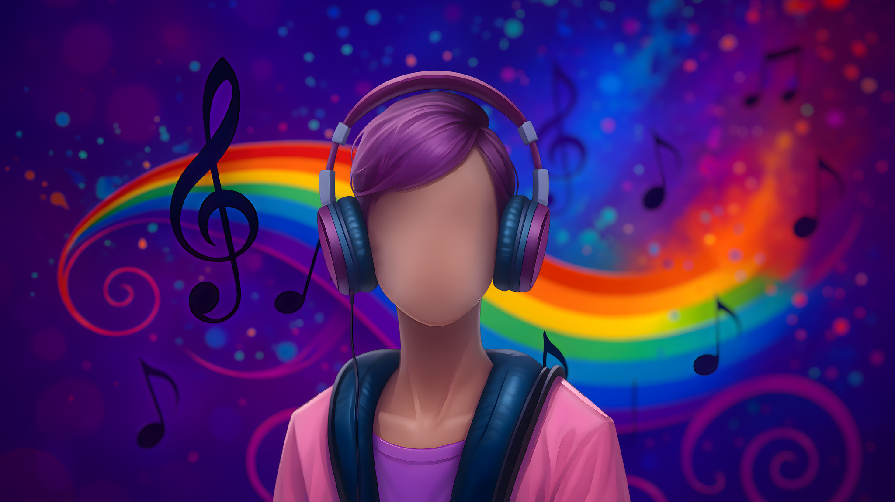

  

## 
BlobbyOfficial

  

---

# About Me

I’m **BlobbyOfficial**, a faceless YouTuber, musician, UI designer, and Roblox developer.  
I focus on creating content and projects that are engaging, creative, and fun.  
Everything I share reflects my interest in exploring different forms of digital creativity while keeping my work accessible to a wide audience.

---

# What I Do

## Music
I produce and release music that blends various styles and influences. My goal is to create tracks that are unique, memorable, and enjoyable to listen to.

## UI Design
I design clean, functional, and visually appealing user interfaces. My focus is on making digital experiences intuitive and easy to use.

## Roblox Development
I develop Roblox projects ranging from small ideas to larger interactive experiences. Roblox gives me the space to combine creativity, coding, and design to build projects that people can enjoy and share.

## YouTube
As a faceless creator, I share content that highlights my work and creative projects. My channel focuses on bringing people into the world of music, design, and game development without relying on personal identity.

---

# Looking Ahead
My aim is to continue building my presence as a creator across platforms. I’m always working on new projects in music, design, development, and content creation, with the goal of expanding what I can share with the community.

---

# Let's Connect

  
  
  
  

---

> :rocket: Thanks for checking out my portfolio! Explore my music, design projects, Roblox creations, and community links.
